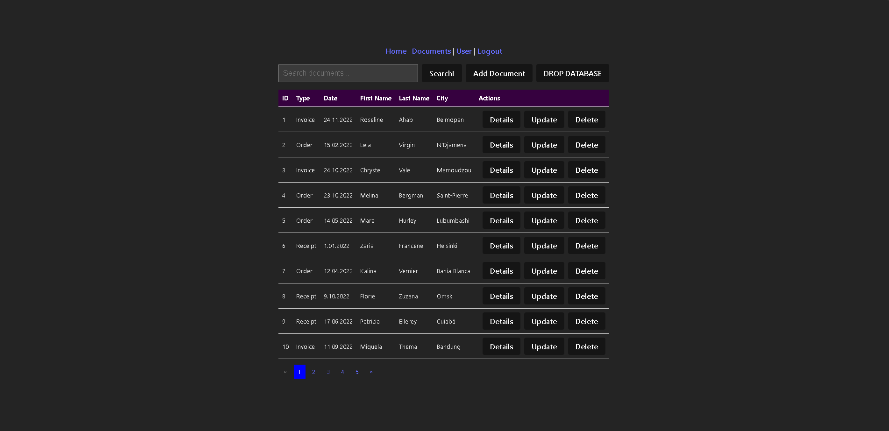

# simple_project_task


## Description

The "simple_project_task" project is a web application designed for document management. It allows users to browse, add, and manage documents after logging in. The application is developed using C# 12 and .NET 8.0, and utilizes VueJS, Microsoft SQL Server, and the Identity Framework for user authentication and authorization management.

## Technologies

- **C# 12**
- **.NET 8.0**
- **Microsoft SQL Server**
- **Identity Framework**
- **SSMS (SQL Server Management Studio)**
- **VueJS**
- **JavaScript**
- **Vite**

## Requirements

Users must register and log in to view documents. To add documents, users must complete their personal information.

## Configuration

### Backend

Create an `appsettings.json` file for database configuration, as follows:

```json
{
  "ConnectionStrings": {
    "DefaultConnection": "conn_string_db"
  },
  "Logging": {
    "LogLevel": {
      "Default": "Information",
      "Microsoft.AspNetCore": "Warning"
    }
  },
  "AllowedHosts": "*"
}
```


### Frontend:  
Install packages: 
```bash
npm install
```
### Backend pt2:  
In most cases, NuGet packages should install automatically, but just in case:
```bash
dotnet restore
dotnet run  
```
